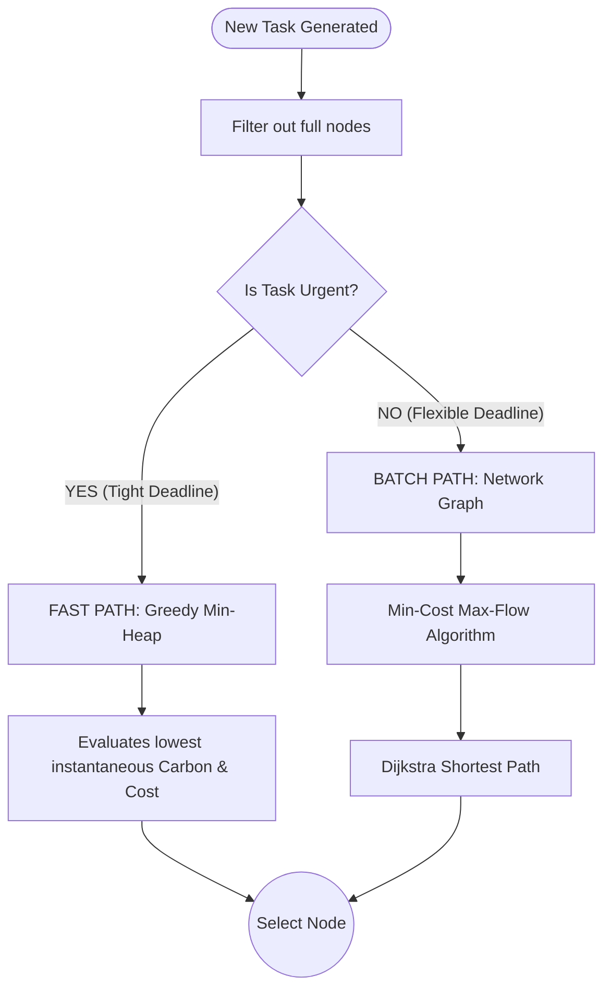
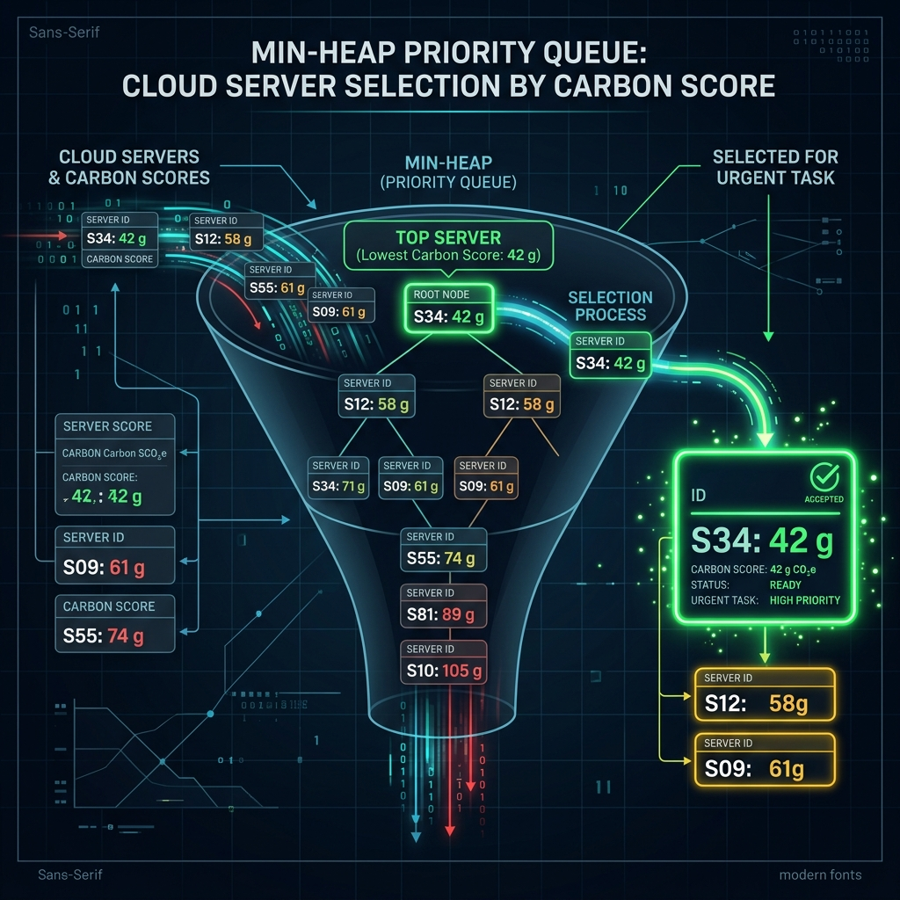

# How CarbonGrid Works: From Dashboard to C++ Engine

When you enter your parameters and click **"START SIMULATION"**, a complex sequence of events kicks off across three distinct layers of the project: the **Browser (Frontend)**, the **Python Server (Middleman)**, and the **C++ Core Engine (Backend)**.

Here is the step-by-step breakdown of how data flows and how decisions are made.

## 1. The Architecture Flow

When you interact with the UI, you are triggering a chain reaction:

```mermaid
sequenceDiagram
    participant UI as Web Dashboard
    participant Py as Python Server (server.py)
    participant C++ as CarbonGrid.exe (C++)
    participant JSON as metrics.json
    
    UI->>Py: POST /api/start (Tasks, Rate, Delay)
    Py->>C++: Spawns Process: CarbonGrid.exe <tasks> <rate> <delay>
    
    loop Simulation Loop
        C++->>C++: 1. Generate Task
        C++->>C++: 2. DAA Algorithm selects Node
        C++->>C++: 3. Allocate & Execute Task
        C++->>JSON: 4. Write current state to metrics.json
    end
    
    loop Every 100ms
        UI->>Py: GET /api/data
        Py->>JSON: Reads metrics.json
        JSON-->>Py: Return data
        Py-->>UI: Return JSON data
        UI->>UI: Update Charts, Nodes & Traces
    end
```

### Step 1: The Frontend Request
When you click start, JavaScript reads the inputs (Total Tasks, Tasks/sec, Speed/Delay) and sends an HTTP `POST` request to `/api/start`.

### Step 2: The Python Middleman
The Python server (`server.py`) receives this request. Its job is simply to translate web requests into local system commands. It takes your inputs and runs the C++ executable as a subprocess, passing your inputs as command-line arguments:
`./build/CarbonGrid.exe [total_tasks] [rate] [delay]`

### Step 3: The C++ Core Loop
The C++ program starts and enters a massive `while` loop. Inside this loop, it generates tasks, schedules them, and executes them in simulated time. As it does this, it continuously overwrites a file located at `dashboard/data/metrics.json` with the current state of every node, the carbon saved, and the task throughput.

### Step 4: The Frontend Polling
Meanwhile, your browser is continuously asking the Python server (`GET /api/data`) for the latest metrics. The Python server reads `metrics.json` and sends it to the browser, which then animates the bars, traces, and text you see on the screen.

---

## 2. How Tasks are Generated

Inside the C++ engine, there is a `WorkloadGenerator` component. 

1. **Arrival Times:** It uses a mathematical model (usually a Poisson process) to determine exactly *when* the next task should arrive based on the "Tasks/sec" rate you provided.
2. **Task Properties:** When a task is born, it is randomly assigned requirements based on real-world cloud statistical distributions:
   - **CPU & RAM:** How much processing power it needs.
   - **Duration:** How long it takes to run.
   - **Deadline:** When it absolutely must be finished. Tasks with tight deadlines are marked as **Urgent**, while tasks with distant deadlines are marked as **Flexible**.

---

## 3. How Nodes are Chosen (The Scheduling Algorithm)

This is the "brain" of the project—the **Dynamic Allocation Algorithm (DAA)**. 
When a task is generated, the scheduler must decide which region (e.g., US-East, Europe, Asia) and which specific node gets the task. 

It does this in two major steps:

### A. The Feasibility Filter
Before picking the *best* node, it throws out the *impossible* nodes. If a task requires 8 cores, and `node_3` in Europe only has 2 cores available, `node_3` is immediately filtered out. 

### B. The Routing Algorithm (Dual-Path)
For the nodes that *can* handle the task, the scheduler looks at the task's urgency to decide how to pick the best one:



* **The Fast Path (Greedy Min-Heap):** If a task is urgent, the scheduler doesn't have time to do complex math. It uses a Min-Heap data structure to instantly pluck out the node that currently has the lowest combined carbon footprint and electricity cost. It's fast and gets the job done immediately.
  
* **The Batch Path (MCMF + Dijkstra):** If the task is flexible (like a data backup or batch processing), the scheduler builds a complex mathematical graph. It treats nodes as "sinks" and tasks as "flow". It uses the **Minimum Cost Maximum Flow** algorithm combined with **Dijkstra's Shortest Path** to find a global optimum. This means it might hold off on scheduling a task if it predicts that the sun will come up in Europe in an hour, making solar energy cheaper and greener!

Once the node is selected, the `ExecutionEngine` reserves the CPU/RAM on that node, the simulation clock ticks forward, and the cycle repeats.


## Deep Dive: Inside the C++ Simulation Loop

Based on the actual C++ source code (`src/` directory), here is a microscopic look at exactly what happens during each step of the simulation loop shown in your sequence diagram.

### 1. Generate Task (`WorkloadGenerator.cpp`)
When `WorkloadGenerator::generate_task(current_time)` is called, the C++ code uses `std::mt19937` (a Mersenne Twister random number generator) to simulate unpredictable real-world cloud workloads:
* **CPU and RAM Requirements:** Sampled using a `std::normal_distribution` (bell curve).
* **Execution Duration:** Sampled using a normal distribution.
* **Deadline & Urgency:** A random subset of tasks are flagged as "urgent" (tight deadlines). The exact deadline timestamp is calculated mathematically as `arrival_time + duration * slack_multiplier`.
The new `Task` struct is created in memory and handed over to the scheduling engine.

### 2. DAA Algorithm Selects Node (`DAAEngine.cpp`)
The `DAAEngine::schedule()` method is the core decision maker. It receives the `Task` and executes the following logic:

1. **Feasibility Filter:** It scans all nodes in the global `CloudState`. If a node does not have enough free CPU or RAM to physically hold the task, it is immediately discarded from the list of candidates.
2. **Urgency Check:** It calculates the task's slack time (`deadline - current_time - execution_duration`). If the slack is smaller than a strict threshold, the task is routed to the **Fast Path**. Otherwise, it goes to the **Batch Path**.

**The Fast Path (`GreedyScheduler.cpp`)**
* The scheduler loops through every feasible node.
* It asks the `CarbonEngine` for the node region's instantaneous Carbon Intensity (gCO2/kWh), Electricity Cost ($), and Renewable Energy %.
* It feeds these numbers into a `ScoringFunction` to calculate a single unified score.
* It pushes every node's score into a `std::priority_queue` (a C++ Min-Heap data structure).
* It immediately pops the top of the Min-Heap (`min_heap.top()`). This ultra-fast `O(1)` operation instantly yields the absolute best node for the task.

**The Batch Path (`MCMFScheduler.cpp`)**
* Flexible tasks are placed into a `flexible_batch_` array. Once the batch is full, they are processed all together.
* **Graph Construction:** It builds a massive mathematical flow network (`FlowGraph`). The tasks, nodes, and future time slots become "vertices", connected by "edges" weighted by predicted carbon/cost scores.
* **Dijkstra & Flow Algorithm:** It runs Dijkstra's Shortest Path algorithm repeatedly, pushing "flow" (tasks) through the cheapest "pipes" (nodes in future time slots) until all tasks are optimally assigned globally.

### 3. Allocate & Execute Task (`ExecutionEngine.cpp`)
Once the algorithm spits out a winning node ID:
* `ExecutionEngine::schedule_task()` calls the `ResourceAllocator` to subtract the task's required CPU and RAM from the physical node's available capacity.
* The task's state changes from `QUEUED` to `RUNNING`.
* During every "tick" of the simulation clock, `ExecutionEngine::update(current_time)` checks if `current_time >= scheduled_time + execution_duration`. When that becomes true, the task is marked `COMPLETED` and the CPU/RAM is released back to the node.

### 4. Write State (`server.cpp` & `metrics_engine.cpp`)
* Periodically, the `MetricsEngine` takes a complete snapshot of the entire cloud state.
* It bundles the pending task count, running count, carbon reduction %, cost savings, and node capacities into a `JsonObject`.
* The `DashboardServer::write_metrics_file()` function physically opens `dashboard/data/metrics.json` on your hard drive and overwrites it with this JSON string.
* This is exactly what the Python server reads and what the browser fetches to update the dashboard UI!

---

## Visual Glossary

To help visualize the internal mathematics and architecture of the `DAAEngine`, here are three diagrams representing the core concepts:

### 1. The Global Routing Architecture
This represents the high-level view of the **CarbonGrid Scheduler**. Incoming tasks are evaluated by the central engine and routed through global data streams to the geographic region (e.g., US-East, Europe, Asia) that currently has the greenest energy grid.


### 2. The Fast Path (Greedy Min-Heap)
When a task is marked as **Urgent**, it goes through this Min-Heap priority queue. Every feasible server is scored based on carbon intensity and cost. The heap instantly bubbles the server with the lowest score to the top, allowing `GreedyScheduler.cpp` to pluck it out in `O(1)` time.



### 3. The Batch Path (MCMF Flow Network)
When tasks are **Flexible**, they are batched together. `MCMFScheduler.cpp` builds a mathematical flow graph like the one below. The sources on the left are tasks, and the sinks on the right are cloud servers across different future time slots. Dijkstra's algorithm finds the path of least resistance (lowest carbon) through this network.


---

## Mermaid Algorithm Flowcharts

Here are the detailed, step-by-step logic flows for the two specific C++ scheduling algorithms inside the engine.

### 1. The Fast Path: Greedy Min-Heap Algorithm (`GreedyScheduler.cpp`)
Used for Urgent tasks. It sacrifices global optimality for absolute speed ($O(N \log N)$ complexity).

```mermaid
flowchart TD
    Start([Receive Urgent Task]) --> Init[Initialize empty Min-Heap]
    Init --> Loop[For each Feasible Node in CloudState]
    
    Loop --> Calc[Calculate Node's Instantaneous<br>Carbon & Cost Score]
    Calc --> Push[Push Node + Score into Min-Heap]
    Push --> Check{More Nodes?}
    
    Check -- Yes --> Loop
    Check -- No --> Pop[Pop Top Node from Min-Heap<br>Extremely Fast O(1) Time]
    
    Pop --> Assign[Assign Task to Top Node]
    Assign --> End([Task Scheduled Successfully])
```

### 2. The Batch Path: Min-Cost Max-Flow Algorithm (`MCMFScheduler.cpp`)
Used for Flexible tasks. It builds a massive graph to find the mathematically perfect global schedule, factoring in future predicted carbon drops.

```mermaid
flowchart TD
    Start([Receive Batch of Flexible Tasks]) --> Build[Initialize Empty Flow Network Graph]
    
    Build --> AddSrc[Add 'Source' Vertex connected to all Task Vertices]
    AddSrc --> AddEdges[Add Edges from Tasks to Node-TimeSlots<br>Edge Weight = Predicted Carbon Score]
    AddEdges --> AddSink[Add Edges from Node-TimeSlots to 'Sink' Vertex<br>Edge Capacity = Node CPU Available]
    
    AddSink --> MCMFLoop[Run Dijkstra's Shortest Path<br>using Johnson's Potentials]
    
    MCMFLoop --> PathFound{Shortest Path<br>to Sink Found?}
    
    PathFound -- Yes --> Augment[Push 'Flow' (Task) along Shortest Path]
    Augment --> Update[Update Residual Graph Capacities]
    Update --> MCMFLoop
    
    PathFound -- No (All Tasks Assigned) --> Extract[Extract Final Assignments from Graph Flow]
    Extract --> End([Return Batch Scheduling Decisions])
```
