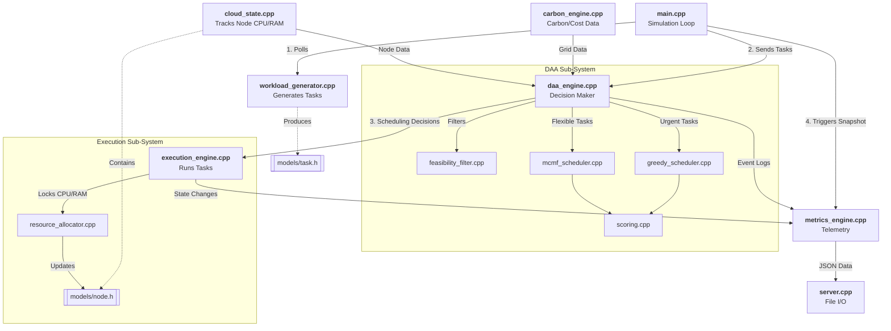
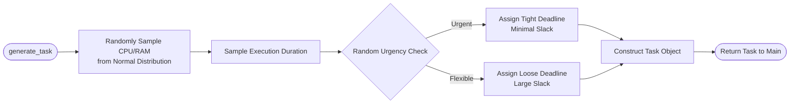
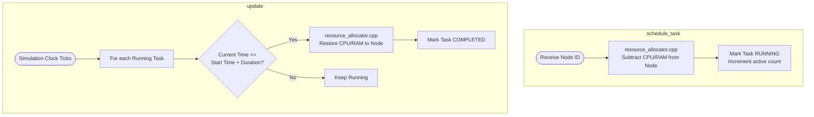
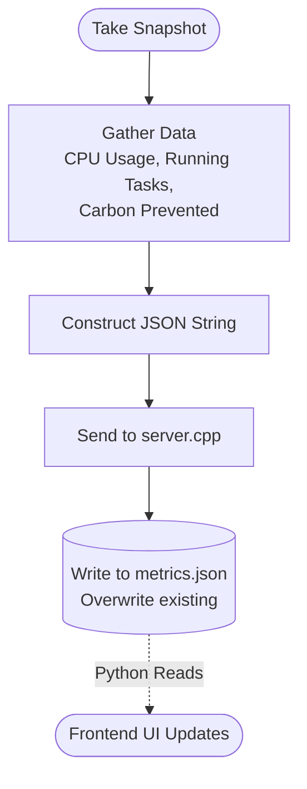

# CarbonGrid C++ Architecture Diagrams

Below are the Mermaid diagrams detailing how the entire C++ codebase connects together, followed by isolated diagrams explaining the internal logic of each specific file.

---

## 1. Global Architecture (How the Files Connect)
This diagram shows how `main.cpp` acts as the conductor, orchestrating the flow of data between the various `.cpp` engines.



---

## 2. File-Level Deep Dives

### A. `workload_generator.cpp`
This file is responsible for creating realistic tasks using statistical mathematics.



### B. `daa_engine.cpp`
This is the traffic cop that receives tasks and routes them to the correct algorithm.

```mermaid
flowchart TD
    Start([schedule task]) --> Filter[Call feasibility_filter.cpp]
    Filter --> IsFeasible{Are there nodes<br>with enough space?}
    
    IsFeasible -- No --> Fail([Return FAILED Decision])
    IsFeasible -- Yes --> Urgency{Is Task Urgent?}
    
    Urgency -- Yes --> Greedy[Send to greedy_scheduler.cpp]
    Greedy --> Succ1([Return Greedy Decision])
    
    Urgency -- No --> Batch[Hold Task in memory<br>(flexible_batch)]
    Batch --> Full{Is Batch Full?}
    
    Full -- Yes --> MCMF[Send entire batch to<br>mcmf_scheduler.cpp]
    MCMF --> Succ2([Return Batch Decisions])
    
    Full -- No --> Defer([Return DEFERRED Decision<br>Wait for more tasks])
```

### C. `execution_engine.cpp`
This file manages the lifecycle of a task once it has been assigned a server.



### D. `metrics_engine.cpp` & `server.cpp`
These files work together to generate the JSON that powers the dashboard.


