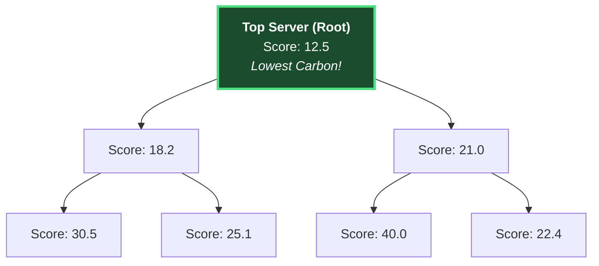
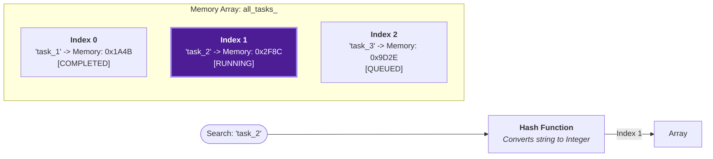
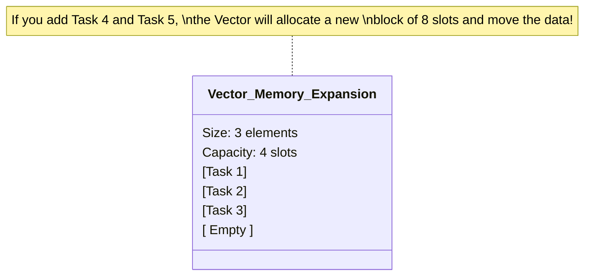

# Core Data Structures in CarbonGrid

The C++ engine uses several highly optimized data structures to ensure the simulation runs in fractions of a millisecond. Here is a breakdown of the primary data structures used and Mermaid diagrams showing how they work.

---

## 1. Min-Heap (Priority Queue)
**File:** `greedy_scheduler.cpp` and `mcmf_scheduler.cpp` (Dijkstra)
**C++ Type:** `std::priority_queue`

A Min-Heap is a specialized binary tree where the "smallest" element is always at the very top (the root). In `GreedyScheduler`, nodes are scored based on their carbon and cost. The node with the *lowest* score is bubbling to the top of the heap. 
When the algorithm needs the best node, it just grabs the top element in **O(1) time**.

---

## 2. Adjacency List (Mathematical Graph)
**File:** `mcmf_scheduler.cpp`
**C++ Type:** `std::vector<std::vector<Edge>>`

To run the MCMF (Min-Cost Max-Flow) algorithm, the engine builds a "Flow Graph". Because a matrix would use too much memory for thousands of nodes and time-slots, it uses an **Adjacency List**. 
It is basically an array of "Vertices", where each Vertex points to a linked-list (or vector) of the "Edges" (pipes) connecting it to other vertices.

```mermaid
flowchart LR
    subgraph Adjacency List Array
        direction LR
        V0[<b>Vertex 0</b><br>Source] --> E0[Edge to Task 1] --> E1[Edge to Task 2] --> E_N1[...]
        
        V1[<b>Vertex 1</b><br>Task 1] --> E2[Edge to EU-Node Slot 1] --> E3[Edge to US-Node Slot 1] --> E_N2[...]
        
        V2[<b>Vertex 2</b><br>EU-Node Slot 1] --> E4[Edge to Sink]
        
        V3[<b>Vertex N</b><br>Sink] --> Null[<i>No outgoing edges</i>]
    end
    
    classDef vertex fill:#1e1e2f,stroke:#7c3aed,stroke-width:2px;
    classDef edge fill:#2d2d44,stroke:#38bdf8,stroke-width:1px;
    class V0,V1,V2,V3 vertex;
    class E0,E1,E2,E3,E4,E_N1,E_N2 edge;
```

---

## 3. Hash Map (Dictionary)
**File:** `execution_engine.cpp`
**C++ Type:** `std::unordered_map<std::string, Task*>`

When the simulation has millions of tasks, it needs a way to instantly find a specific task by its ID (e.g. `task_10452`) to update its status or cancel it. An `unordered_map` uses a hashing mathematical function to convert the text ID directly into a memory address. This allows **O(1)** instant lookups without searching through a list.

---

## 4. Dynamic Arrays
**File:** Everywhere (e.g., `workload_generator.cpp`)
**C++ Type:** `std::vector<Task>` or `std::vector<Node*>`

The standard `std::vector` is used to hold dynamic lists of items (like the list of feasible nodes or the list of recently completed tasks). Unlike arrays in older C, `std::vector` automatically doubles its memory size behind the scenes when it gets full.

