# CarbonGrid: Master UML & Architecture Diagrams

Here is the complete suite of software engineering diagrams you requested. These diagrams model the system from every possible angle (Objects, Time, States, and Architecture).

---

## 1. Class Diagram
Shows the primary C++ classes, their properties, methods, and how they relate to one another (Composition and Dependency).

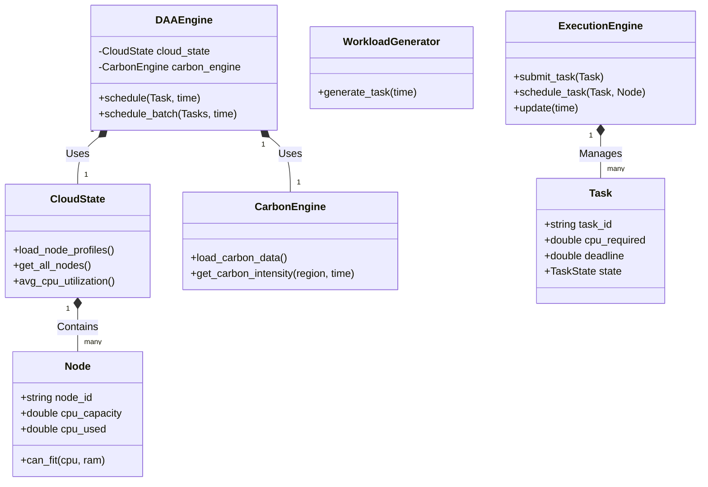

---

## 2. Sequence Diagram
Shows the chronological order of operations across the system over time when a single task is generated and scheduled.

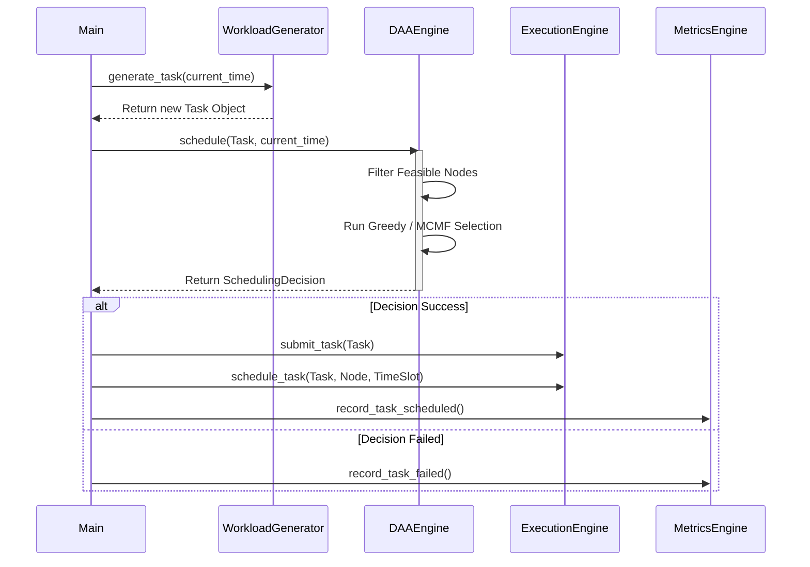

---

## 3. State Machine Diagram
Tracks the lifecycle of a single `Task` object from the moment it is born to the moment it dies.

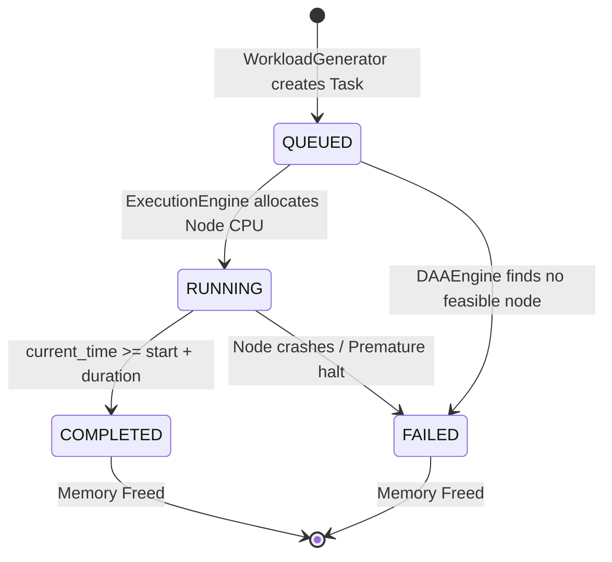

---

## 4. Activity Diagram
Visualizes the control flow of the massive infinite `while` loop running inside `main.cpp`.

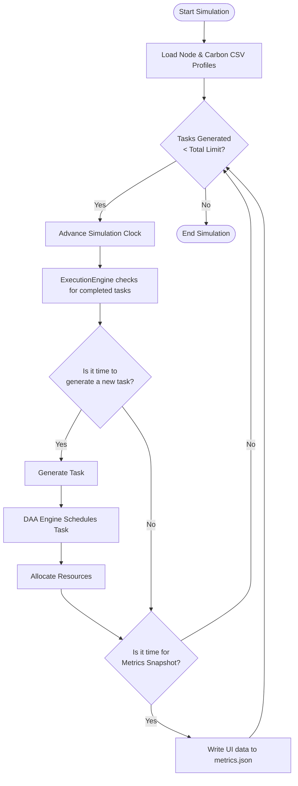

---

## 5. Component Diagram
Shows the logical grouping of internal software components and how they communicate.

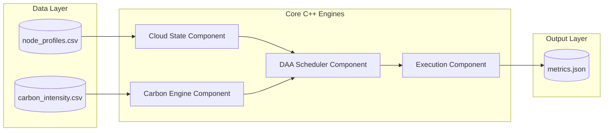

---

## 6. System Architecture Diagram
The high-level macro view showing how the Frontend Browser, Python Middleware, and C++ Backend interact across different processes.

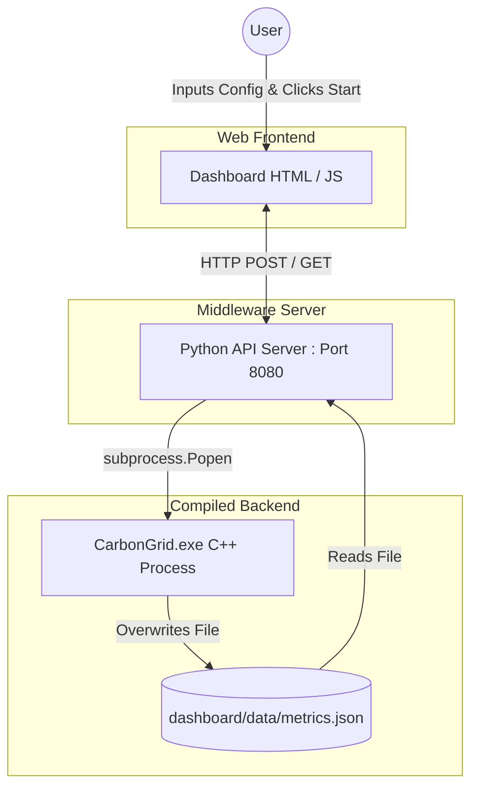

---

## 7. Node Lifecycle Diagram
Shows the physical lifecycle states of a simulated Cloud Server Node as tasks arrive and leave.

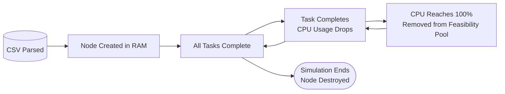

---

## 8. Entity-Relationship Diagram (ERD)
This diagram maps out the strict data relationships between the core structures in the system. It shows how regions contain nodes, nodes execute tasks, and tasks generate metrics.

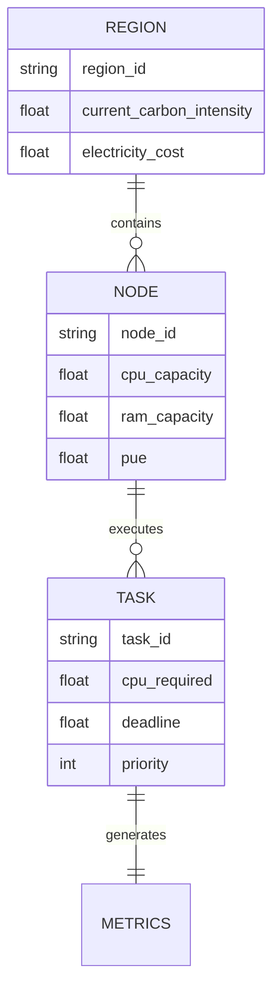

---

## 9. Advanced Lifecycle: The "Flexible" Task
In our earlier state diagram, tasks went straight from QUEUED to RUNNING. However, if a task is "Flexible" (not urgent), it goes through a completely different deferred lifecycle state.

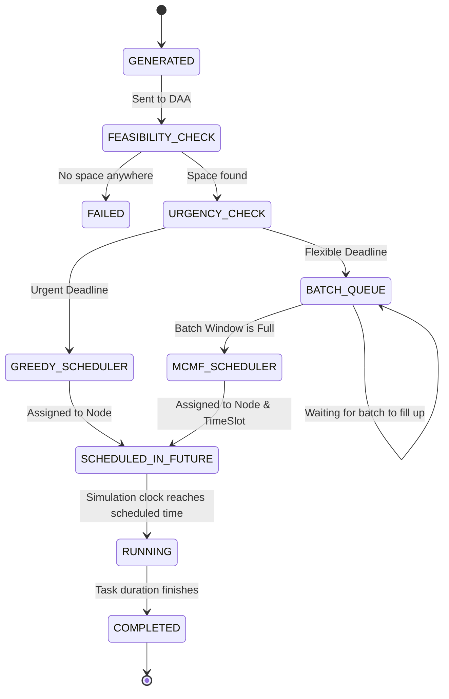

---

## 10. Dashboard Server Request Lifecycle
This maps the exact lifecycle of what happens when you press buttons on the web interface, showing how the Python server acts as a middleman protecting the C++ process.

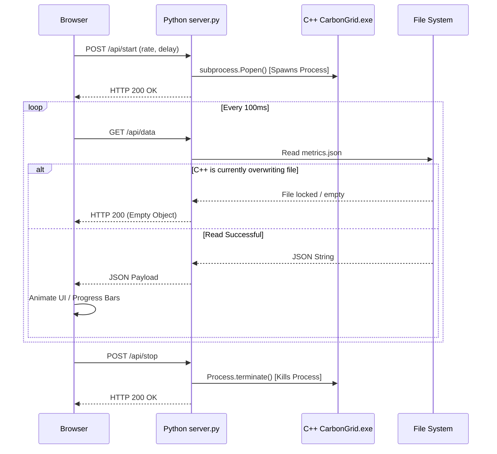

---

# Event and Metrics Pipeline

This diagram illustrates how scheduling and execution events trigger telemetry recordings, which are then aggregated into the dashboard snapshot.

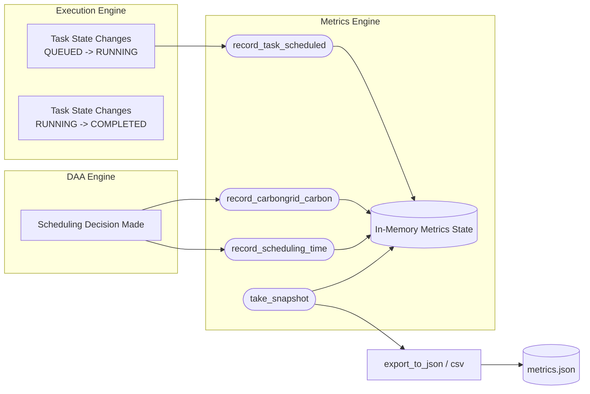


---

# Algorithm Selection and Comparison

This diagram and table break down the dual-path routing algorithm, showing how the engine chooses between speed and global optimality based on task urgency.

```mermaid
flowchart TD
    Start{Incoming Task Urgency}
    
    subgraph "Fast Path (Greedy)"
        Urgent[Urgent Task / Tight Deadline] --> Greedy[Greedy + Min-Heap]
        Greedy --> O1[O(1) Selection]
        O1 --> HighSpd[High Speed, Local Optimum]
    end
    
    subgraph "Batch Path (MCMF)"
        Flexible[Flexible Task / Loose Deadline] --> Batch[Batch Window]
        Batch --> Graph[Build Flow Network]
        Graph --> Dijkstra[MCMF + Dijkstra]
        Dijkstra --> GlobalOpt[Slower Speed, Global Optimum]
    end
    
    Start --> Urgent
    Start --> Flexible
    
    HighSpd --> Exec[Execution Engine]
    GlobalOpt --> Exec
```

## Algorithm Comparison Table

| Feature | Fast Path (Greedy Min-Heap) | Batch Path (MCMF + Dijkstra) |
| :--- | :--- | :--- |
| **Use Case** | Urgent, low-latency tasks | Flexible, batch processing tasks |
| **Complexity** | $O(N \log N)$ | Polynomial (Flow Network) |
| **Optimality** | Local (Best available right now) | Global (Perfect mapping across future time) |
| **Data Structure** | `std::priority_queue` | `std::vector<std::vector<Edge>>` (Adjacency List) |
| **Carbon Impact** | Good | Excellent (Can defer execution to greener times) |


---

# Simulation Timeline

This sequence diagram illustrates the chronological ticks of the internal C++ simulation clock, demonstrating how time progresses and events fire.

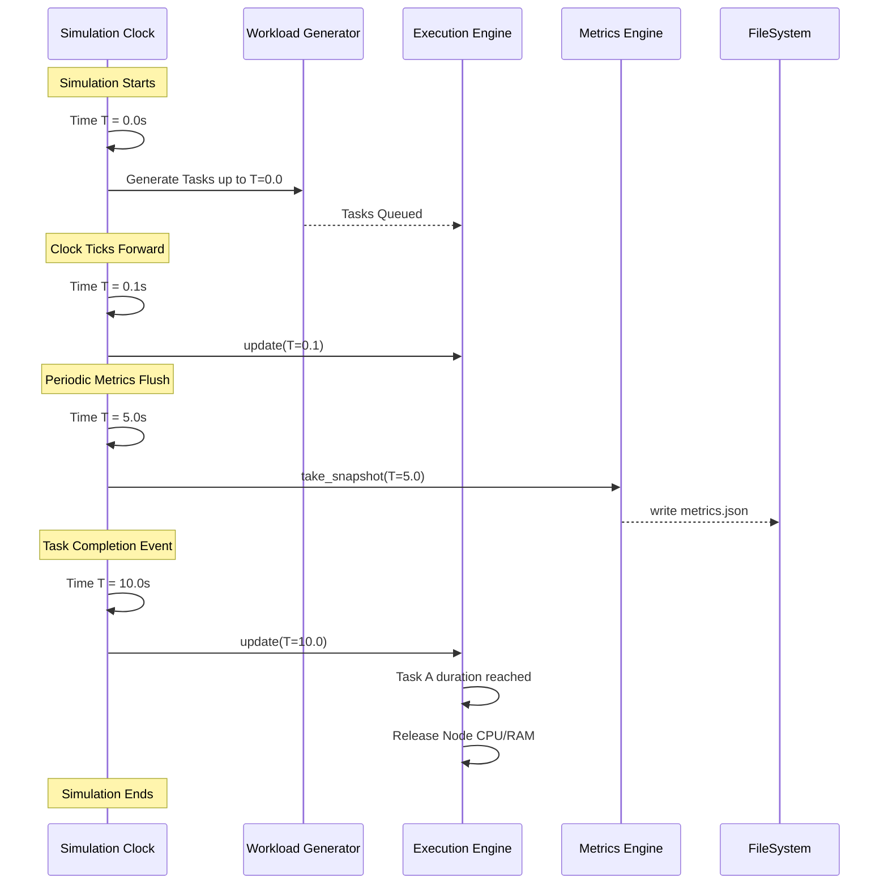


---

# C4 Architecture Diagrams

The C4 model provides different levels of zoom for software architecture. Below are the **System Context** (Level 1) and **Container** (Level 2) diagrams.

## 1. System Context Diagram (Level 1)
Shows the big picture: how the user and external data systems interact with CarbonGrid.

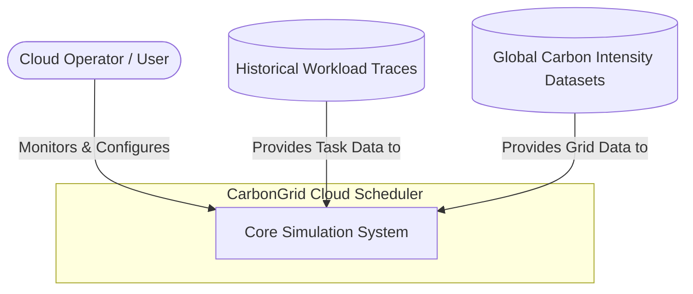

## 2. Container Diagram (Level 2)
Zooms inside the system to show the major containers (Frontend, API, Core Engine, Database/Files).

```mermaid
flowchart TD
    User([Cloud Operator])
    
    subgraph CarbonGrid System
        UI[Web Dashboard<br>HTML / JavaScript / CSS]
        API[Web API Server<br>Python 3]
        Core[Core Simulation Engine<br>C++17]
        MetricsDB[(Metrics File Store<br>JSON / CSV)]
    end
    
    User -->|Views and Interacts| UI
    UI -->|Polls for Data (HTTP GET)| API
    API -->|Spawns & Monitors Process| Core
    Core -->|Writes Telemetry| MetricsDB
    API -->|Reads Telemetry| MetricsDB
```


---

# Carbon-Aware Scheduling Decision Flowchart

This flowchart outlines the exact mathematical and logical steps taken by the scoring function to rank nodes purely based on carbon and monetary cost.

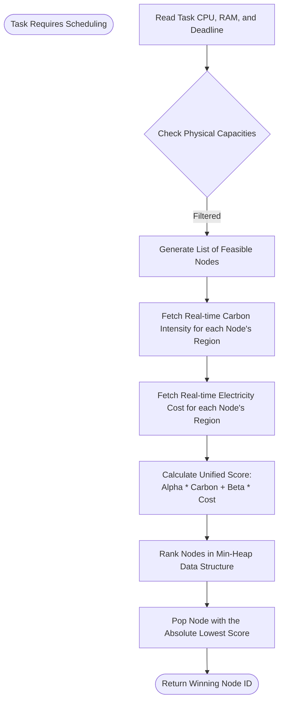


---

