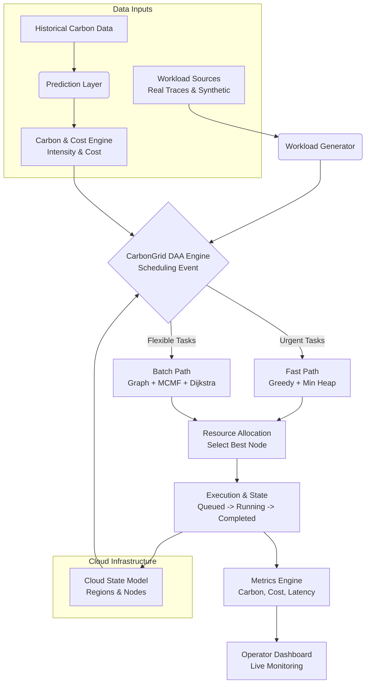
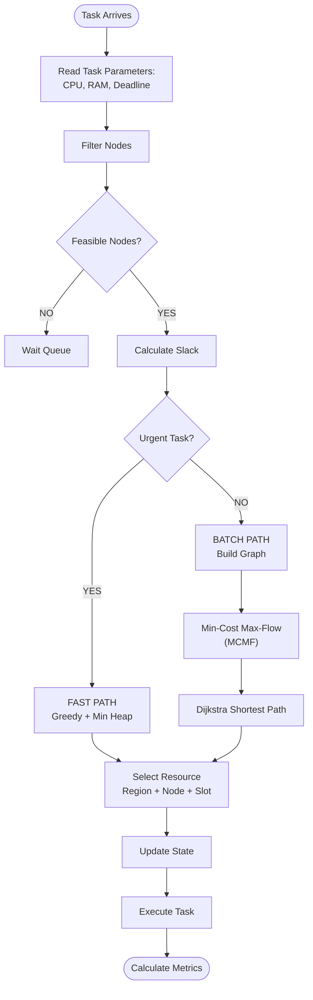

# Carbon-Aware Cloud Scheduler (CarbonGrid)

A high-performance C++ simulation engine for carbon-aware cloud resource scheduling. It utilizes advanced algorithmic techniques to dynamically schedule cloud workloads across multiple geographic regions based on real-time carbon intensity and electricity costs.

## Features
* **Dual-Algorithm Scheduling Engine**: Uses a **Greedy + Min-Heap** approach for low-latency urgent tasks, and **MCMF (Minimum Cost Maximum Flow) + Dijkstra** for batch scheduling of flexible tasks.
* **Multi-Region Cloud State**: Simulates global cloud nodes with varying Power Usage Effectiveness (PUE), tracking dynamic CPU/RAM utilization.
* **Carbon & Cost Optimization**: Balances strict deadlines with carbon minimization and cost reduction goals using a configurable scoring function.
* **Web Dashboard**: An HTML/JS dashboard that visualizes real-time metrics, carbon reduction, and scheduling throughput over WebSockets/file-polling.
* **Data Preprocessing**: Includes Python tools to parse and ingest real-world cloud workload traces (e.g., Alibaba Cluster Data).

## Requirements

To build and run this project, you need the following installed:
* **C++17 Compatible Compiler** (e.g., GCC, Clang, or MSVC)
* **CMake** (version 3.20 or higher)
* **Python 3.x** (to run data generation scripts like `generate_carbon.py`)
* **Modern Web Browser** (to view the real-time simulation dashboard)

## Architecture

The engine is structured to isolate data generation, scheduling logic, resource allocation, and metrics tracking into independent, highly cohesive components.



## Algorithm Flowchart (DAA Flow)

The Dynamic Allocation Algorithm (DAA) handles task scheduling based on urgency and feasibility:



## Build Instructions

```bash
# 1. Generate the required initial carbon data
python generate_carbon.py

# 2. Build the C++ project
cmake -B build -S .
cmake --build build
```

## Running the Simulation

Run the generated executable:
```bash
./build/CarbonGrid
```
*(On Windows, you may need to run `.\build\Debug\CarbonGrid.exe` or `.\build\CarbonGrid.exe` depending on your build system)*

While the simulation is running, open `dashboard/index.html` in any modern web browser to view the live telemetry and carbon reduction metrics.
